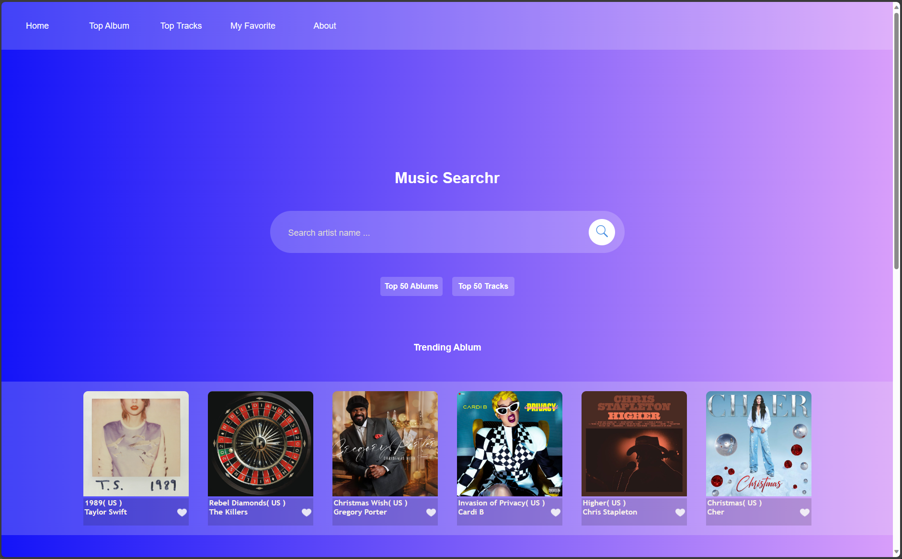
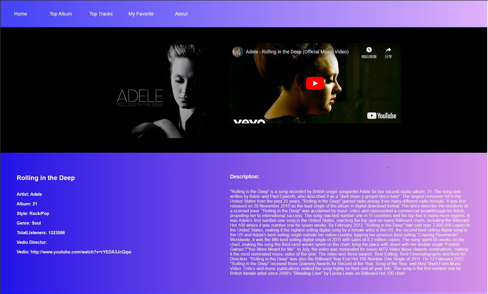

# Music Search Website

## Overview
The Music Search website provides an extensive platform for music exploration, utilizing the free music API from TheAudioDB. Users can search for albums and tracks based on an artist's name, explore detailed music information, and enjoy trending and top-rated content from various countries. The design incorporates a bright, transparent interface with a pink-blue color scheme, creating an engaging user experience.

## Key Features
- **Artist-Based Search**: Enables users to explore albums and tracks using an artist's name.
- **Trending and Top Music**: Displays trending albums and tracks based on selected countries.
- **Favorites**: Allows users to add their favorite albums and, soon, favorite tracks.
- **Detailed Information**: Provides comprehensive details about music, artists, and albums.
- **YouTube Integration**: Utilizes React Player to stream YouTube videos for selected tracks.

## Wireframes and Diagrams
During the planning stage, wireframes created using Figma illustrated the layout, design.

## Screenshots

## Technical Hurdle
The challenge of optimizing API calls for real-time updates without compromising website performance was addressed by structuring modular APIs and using Axios for requests.

## Learning Experience
Working extensively with React and React Player was insightful. Utilizing database data from TheAudioDB's API facilitated seamless music exploration.

## Technology Overview
The project leverages React for frontend development, Axios for API requests, and React Player for YouTube video playback. The database primarily stems from TheAudioDB's free music API.

## Where Next? Wishlist / Future Features
- **Track Favorites**: The upcoming addition of track favorites will enhance user personalization and engagement.
- **User Profiles**: Introducing user accounts for personalized experiences and storing individual favorites.
- **Enhanced Styling Options**: Expanding style customization for user preference.
- **Refined Search and Filters**: Adding advanced search filters for a more detailed music search experience.

---

For collaborations, suggestions, or inquiries, please feel free to reach out!

This adjustment emphasizes that hand-drawn sketches were used as wireframes to plan the website's structure and layout, even if digital tools like Figma weren't utilized.

